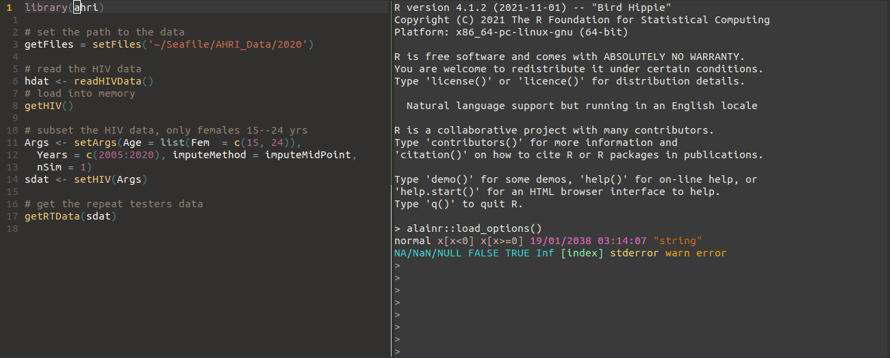
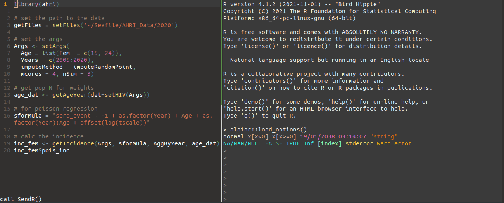

## AHRI R library

The `ahri` R library provides  functions for estimating the HIV incidence
rate with [Africa Health Research Institute (AHRI)]( https://www.ahri.org/research/#research-department )  data. These functions can read in the AHRI
datasets, write them to .Rda format, standardize and 
subset the data, impute the HIV infection events, and calculate unadjused
or age-adjusted HIV incidence rates using a single or multiple imputation
approach. 

The wiki help pages serve as a short introduction to the `ahri` library. These can be
found in the links below. The help files are organised as follows:

- Getting started, which describes how to install the `ahri` library, which AHRI datasets
  to request and where to put them.  It also shows how to set the paths to these datasets.
  https://github.com/vando026/ahri/wiki/1-Getting-started

- Reading and writing the datasets, which describes the functions for performing these
  operations.  https://github.com/vando026/ahri/wiki/2-Read-functions

- Set functions, which describes a range of functions for processing the data, subsetting
  the data, and other data transformations. 
  https://github.com/vando026/ahri/wiki/3-Set-functions

- Utility functions commonly used with HIV incidnece analyses. https://github.com/vando026/ahri/wiki/4-Utility-functions

- Functions to make the HIV incidence datasets, impute the
  HIV dates, perform mid-point, end-point, or single random-point imputation, and calculate the HIV incidence rates by sex or year using multiple imputation. 
  https://github.com/vando026/ahri/wiki/5A-HIV-functions and 
  https://github.com/vando026/ahri/wiki/5B-HIV-functions

- G-imputation functions to impute the HIV times conditional on auxiliary data.
https://github.com/vando026/ahri/wiki/6-G-Imputation

There are other sources of help:

- The `ahri` package has help files and documentation. Type `?ahri` to get to the help
  pages. For more information on a specific function, for example `setFiles`, type
  `?setFiles`.

- Please consult the issues page on this Github site for more information and for answers
  to questions someone before you may have already asked. 

- There is a `Python` version of this [library](https://github.com/vando026/ahri_py) that speads up the HIV incidence calculations. 

## Screen shots

Read and load the data, subset and create repeat-tester data. 

Calculate the HIV incidence rate for women aged 15--24 years. Do 3 imputed datasets using
the single-random point method. 

+---------------------------------------------------------------------------------------+
|Disclaimer: This is not an official AHRI site. The `ahri` library is a collaboration   |
|between researchers using the AHRI datasets.  Decisions made in the code about how to  |
|manage and analyze the data are independent of the views, opinions, and policies of    |
|AHRI and its employees.                                                                |
+---------------------------------------------------------------------------------------+
